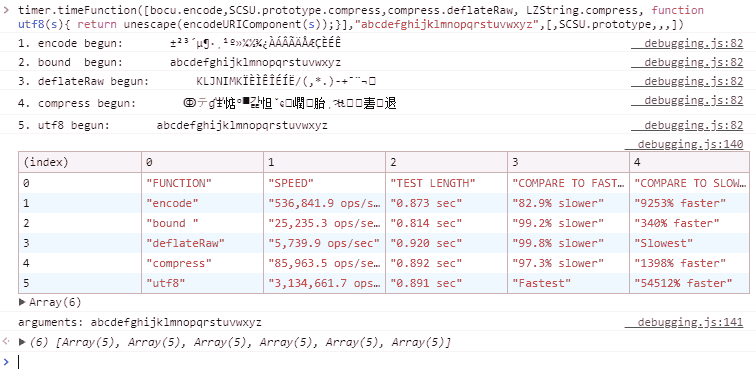

# timer-js

A simple to use, one line, single function call to time either a single function or comparable functions that use the same arguments. Easy to call from your browser's developer tools console. Results are displayed in table form in your console (and given in the timeFunction return value).

The simplest case is: ` timer.timeFunction(myFunction); ` (Don't use parentheses `myFunction()` or you will be passing the result of the function rather than the function definition.)

The general case is `timer.timeFunction([foo,bar,...], ['arg1', arg2,...]);` Pass in function(s) in an array, [foo,bar,...] followed by any arguments. You must pass in multiple arguments wrapped in an array, but should not use an array when only passing one argument as timeFunction uses the .apply() method to call your functions when they require multiple arguments which has more overhead than just invoking the function. All arguments are applied to each function. [See below](#this-keyword) if you need to set *this* for any of your timed functions.

```
timer.timeFunction([reverse16, reverse32], 'abcdefg');
```

A complex example typed into the console along with the output from the console (spread to multiple lines for clarity):
```
timer.timeFunction(
    [bocu.encode,
    SCSU.prototype.compress.bind(SCSU.prototype), //the compress function in SCSU invokes this._privatefunction
    compress.deflateRaw, 
    LZString.compress, 
    function utf8(s){ return unescape(encodeURIComponent(s));}
    ],
    "abcdefghijklmnopqrstuvwxyz")
```



## Timing Code Snippets
You can test a bit of code by just defining a function directly (though it may be simpler to use console.time). For example getting the 10th character from a 26 character string using the spread operator:
```
timer.timeFunction(function () {return [..."abcdefghijklmnopqrstuvwxyz"][10];})
```
Compare Snippets:
```
timer.timeFunction( [ function A(s,n) {return [...s][n];},
                      function B(s,n) {return s[n];} 
                    ], 
                    ["abcdefghijklmnopqrstuvwxyz",10]) // passing more than one argument so wrap in array
```

## Notes
This compares well with timing the function directly. The overhead is minimal. You could even run it blank and then subtract out the overhead. However even a fast reverse16 function with a short 6 char string is more than a hundred times slower than a blank function so the overhead is insignificant. There is definitely some extra time in js when a function is first called so I'm guessing it's keeping the function ready to be reused quickly.

Since this is running from your browser's console, it could slow things down slightly (the console is doing all kinds of things documenting your code) but the results seem relatively consistant with jsperf. Jsperf uses Benchmark.js which you may also be able to use, however I find this much simpler and convenient to use. This can also lag jsperf for very fast code because usually there you aren't getting function returns. Timing intervals could be shorter so that op system is less likely to interupt with other tasks. You could repeat brief tests and sum up for longer total and possibly throw out aberant values that indicate background tasks. But this does a good job at comparing times as is.

## this Keyword
If any of your timed functions invoke *this* you will get an error or incorrect results because when passing a function of an object as a callback *this* no longer refers to that object. To solve, bind the function to its object/namespace.
```timer.timeFunction([ obj1.A, obj2.B.bind(obj2) ], s);```

## ToDo
- might want to be able to get results formatted in an html snippet/page
- When anonymous function is used no name is given in formatted results. Don't think there is a way to get this in js other than using .toSource() which is only supported in Firefox.

## Author
Arthur Marks @aamarks, copyright 2018.

## License
MIT
