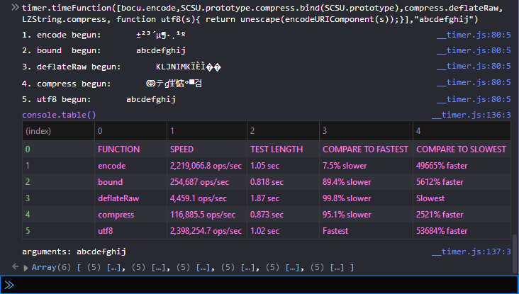

# timer-js

A simple to use, one line, single function call to time either a single function or comparable functions that use the same arguments. Easy to call from your browser's developer tools console. Results are displayed in table form in your console (and given in the timeFunction return value).

You can just include timer in your project during development. For the browser: 
```
<script src="js/__timer.js"></script> <!-- remove from production -->
``` 
and begin using it from the console to test your code.

## timeFunction()
The main function in __timer.js. The simplest usage is timing a single function that takes no arguments: ` timer.timeFunction(myFunction) ` (Don't use parentheses `myFunction()` or you will be passing the result of the function rather than the function definition.)

The general case is `timer.timeFunction([foo,bar,...], ['arg1', arg2,...]);` Pass in function(s) in an array, [foo,bar,...] followed by any arguments. You must pass in multiple arguments wrapped in an array, but should not use an array when only passing one argument as timeFunction uses the .apply() method to call your functions when they require multiple arguments which has more overhead than just invoking the function. All arguments are applied to each function. [See below](#this-keyword) if you need to bind *this* to any of your timed functions.

```javascript
timer.timeFunction([reverse16, reverse32], 'abcdefg')
```

A complex example timing various methods of compressing or encoding a string, typed into the console along with the output from the console (spread to multiple lines for clarity):
```javascript
timer.timeFunction(
    [bocu.encode,
     SCSU.prototype.compress.bind(SCSU.prototype), //the compress function in SCSU invokes this._privatefunction
     compress.deflateRaw, 
     LZString.compress, 
     function utf8(s){ return unescape(encodeURIComponent(s)); }
    ],
    "abcdefghij")
```



## Timing Code Snippets
You can test a bit of code by just defining a function directly (though it may be simpler to use console.time). For example getting the 10th character from a 26 character string using the spread operator:
```javascript
timer.timeFunction( function () {return [..."abcdefghijklmnopqrstuvwxyz"][10];} )
```
Compare Snippets:
```javascript
timer.timeFunction( [ function A(s,n) {return [...s][n];},
                      function B(s,n) {return s[n];} 
                    ], 
                    ["abcdefghijklmnopqrstuvwxyz",10]) // passing more than one argument so wrap in array
```

## *this* Keyword
If any of your timed functions invoke *this* you will get an error or incorrect results because when passing a function of an object as a callback *this* no longer refers to that object. To solve, bind the function to its object/namespace.
```javascript
timer.timeFunction([ obj1.A, 
                     obj2.B.bind(obj2) 
                   ], s)
```

## Other Functions
```javascript
//Overhead
timer.overhead() // times a blank function that just returns a short string passed to it

timer.overheadArgArray() // the same but the argument is passed as an array 
    // as you would do for multiple arguments.
    // This will be slower as the function is invoked using .apply(), 
    // but the difference is insignificant for most uses

//Tests, code comparisons (you can pass a string to each of these or just let defaults be used)
timer.tests.badCodeExamples() // some examples of big time losses writing poor code
timer.tests.forMethods() // comparison of different for loops
timer.tests.stringCharParsing() // comparison of modern string iteration with old 
    // (and illustrating emoji problem)

```

## Notes

- Each test is designed to run very roughly for 1 second unless your function takes longer for even one iteration. Performance.now has significant overhead (if called on every iteration) so it is only called in timeFunction a few times on even the fastest functions to gauge the test length bases upon the initial iterations. It does not later check if the duration is approaching 1 second. If the test length is far from 1 second it is likely the cpu was working on other tasks (could still be the case even near 1 second). The test lengths are reported in the results not for any speed info, but to give some indication of background tasks.

- This compares well with timing the function directly. The overhead is minimal. You could even run it blank and then subtract out the overhead. However even a fast reverse16 function with a short 6 char string is more than a hundred times slower than a blank function so the overhead is insignificant. There is definitely some extra time in js when a function is first called so I'm guessing it's keeping the function ready to be reused quickly.

- Since this is running from your browser's console, it could slow things down slightly, but the results seem relatively consistant with Mathias Bynens' [jsperf](https://jsperf.com/). Jsperf uses Benchmark.js which you may also be able to use, however I find this simpler and more convenient to use. He has been very thorough in ensuring results are statistically significant.

- This is a high performance timer, however browsers are currently [limiting the precision of performance.now]( https://developer.mozilla.org/en-US/docs/Web/API/Performance/now). I doubt this would be the case for node.js, but haven't used node yet other than for things like running Grunt. Regardless, this provides more than adequate analysis of code design. You shouldn't be worried about a few percentage points when the next iteration of browser/node may reverse that, and with a test length of 1 second the effect from that is far less than 1%.

## ToDo
- might want to be able to get results formatted in an html snippet/page
- When an anonymous function is used no name is given in the formatted results. I don't think there is a way to get the name in js other than using .toSource() which is only supported in Firefox.

## Author
Arthur Marks [@aamarks](https://github.com/aamarks), copyright 2018.

## License
MIT
